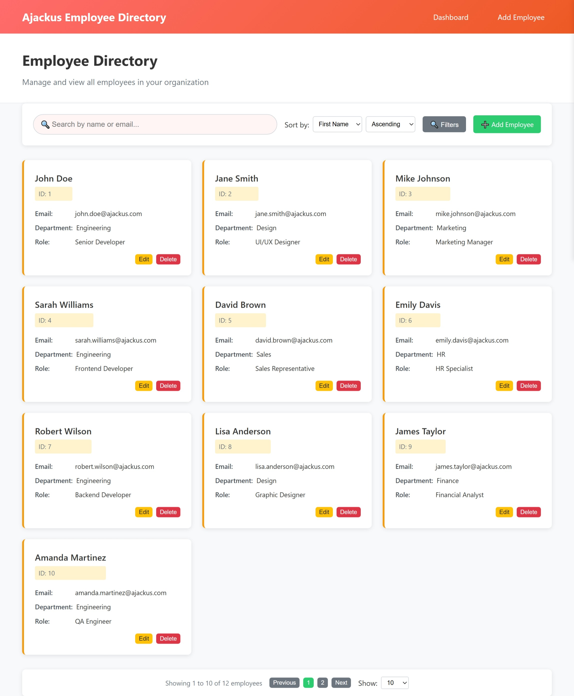
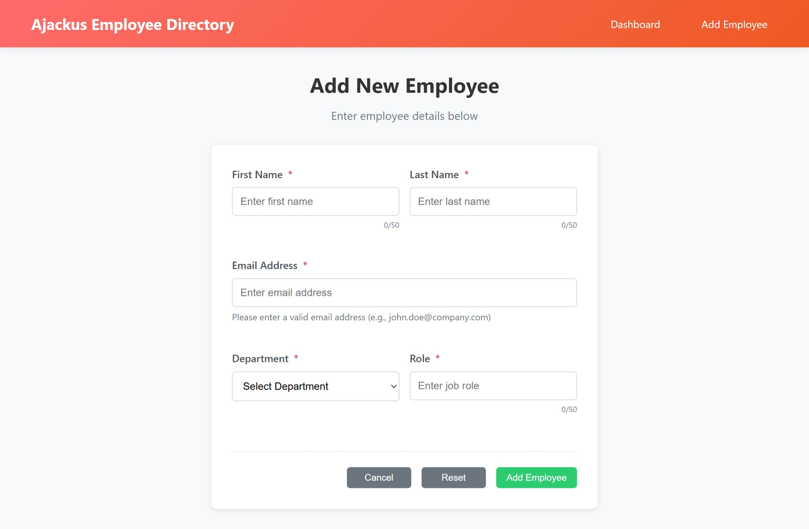

# 🏢 Ajackus Employee Directory Web App

A professional, responsive Employee Directory web application built with vanilla HTML, CSS, and JavaScript. This project demonstrates modern web development practices with a clean, modular architecture and comprehensive error handling.


## ✨ Features

### 🎯 Core Functionality
- **Employee Management**: Complete CRUD operations (Create, Read, Update, Delete)
- **Advanced Search**: Real-time search by name and email with debounced input
- **Smart Filtering**: Filter by department, role, and first name with sidebar interface
- **Flexible Sorting**: Sort by any field in ascending/descending order
- **Pagination**: Configurable page sizes (10, 25, 50, 100) with smart navigation
- **Responsive Design**: Mobile-first approach with tablet and desktop optimization

### 🎨 User Experience
- **Professional UI**: Clean, modern interface with warm color palette
- **Real-time Validation**: Instant form validation with helpful error messages
- **Loading States**: Visual feedback during data operations
- **Success/Error Messages**: Clear user feedback with auto-dismiss
- **Unsaved Changes Warning**: Prevents accidental data loss
- **Smooth Animations**: Transitions and hover effects for better UX

### 🛠️ Technical Features
- **Modular Architecture**: Separated concerns with dedicated CSS and JS files
- **Freemarker Templates**: Simulated backend integration with template rendering
- **In-Memory Data Management**: Complete CRUD operations without backend
- **Cross-Browser Compatibility**: Works on all modern browsers
- **Human-Readable Code**: Comprehensive comments explaining every logic step

## 📸 Screenshots

### Dashboard View

*Main employee list with search, filter, and pagination controls*

### Add/Edit Form

*Professional form with real-time validation and character counters*


*Note: Add actual screenshots to a `screenshots/` folder in your repository*

## 🚀 Quick Start

### Prerequisites
- Modern web browser (Chrome, Firefox, Safari, Edge)
- No additional dependencies required

### Installation

1. **Clone the repository**
   ```bash
   git clone https://github.com/Krishnan-2024/ajackus-employee-directory-1.git
   cd ajackus-employee-directory
   ```

2. **Open in browser**
   ```bash
   # Simply open index.html in your browser
   open index.html
   ```

### Alternative: Local Server (Recommended)

**Using Python:**
```bash
# Python 3
python -m http.server 8000

# Python 2
python -m SimpleHTTPServer 8000

# Then open: http://localhost:8000
```

**Using Node.js:**
```bash
# Install http-server globally
npm install -g http-server

# Start server
http-server

# Then open the displayed URL
```

**Using Live Server (VS Code Extension):**
1. Install "Live Server" extension
2. Right-click on `index.html`
3. Select "Open with Live Server"

## 📁 Project Structure

```
ajackus-employee-directory/
│
├── 📄 index.html                # Entry point (redirects to dashboard)
├── 📄 dashboard.html            # Main employee list page
├── 📄 form.html                 # Add/Edit employee form
│
├── 📁 js/
│   ├── 📄 data.js               # Mock data and data management class
│   ├── 📄 dashboard.js          # Dashboard functionality and controls
│   └── 📄 form.js               # Form validation and submission logic
│
├── 📁 css/
│   ├── 📄 style.css             # Global styles and utilities
│   ├── 📄 dashboard.css         # Dashboard-specific styles
│   └── 📄 form.css              # Form-specific styles
│
├── 📁 templates/
│   └── 📄 employee_list.ftl     # Freemarker template for employee rendering
│
├── 📁 assets/
│   ├── 📄 logo.png              # Application logo (placeholder)
│   └── 📁 icons/
│       └── 📄 README.md         # Icon assets documentation
│
├── 📁 screenshots/              # Application screenshots
│   ├── 📄 dashboard.png
│   ├── 📄 form.png
│   ├── 📄 mobile.png
│   └── 📄 filters.png
│
└── 📄 README.md                 # This file
```

### Data Management
- **In-Memory Storage**: All data stored in JavaScript arrays
- **CRUD Operations**: Complete Create, Read, Update, Delete functionality
- **Search & Filter**: Advanced filtering with multiple criteria
- **Sorting**: Flexible sorting by any employee field
- **Pagination**: Efficient data pagination with configurable page sizes

## 🔧 API Documentation

### Data Manager Class

```javascript
// Get all employees
employeeDataManager.getAllEmployees()

// Get employee by ID
employeeDataManager.getEmployeeById(id)

// Add new employee
employeeDataManager.addEmployee(employeeData)

// Update employee
employeeDataManager.updateEmployee(id, employeeData)

// Delete employee
employeeDataManager.deleteEmployee(id)

// Search employees
employeeDataManager.searchEmployees(query)

// Filter employees
employeeDataManager.filterEmployees(filters)

// Sort employees
employeeDataManager.sortEmployees(employees, sortBy, sortOrder)
```
